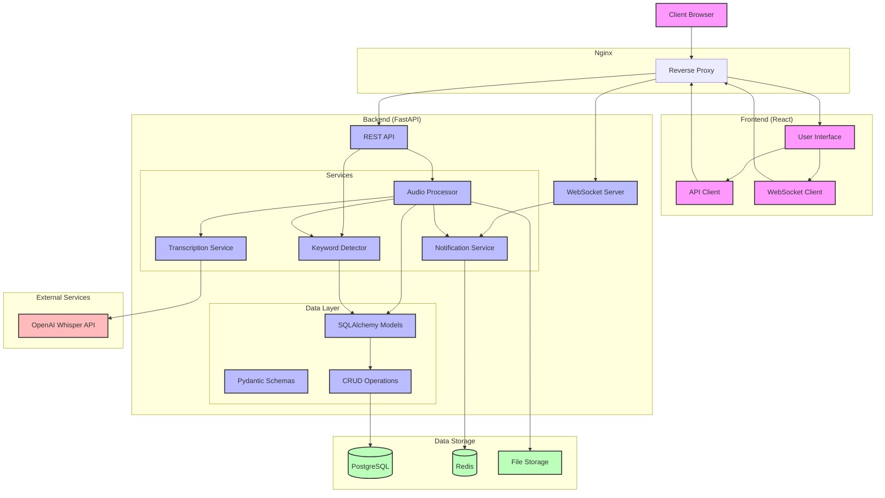

# AI Audio Pipeline Architecture

## Architecture Description

The AI Audio Pipeline is built with a modern microservices architecture that enables real-time audio processing and transcription. Here's a breakdown of the key components:

### Client Layer
- **Client Browser**: End-user interface for uploading audio files and viewing transcriptions

### Frontend Layer
- **React UI**: User interface built with React and styled with modern CSS
- **API Client**: Handles HTTP requests to the backend API
- **WebSocket Client**: Manages real-time communication with the backend

### Nginx Layer
- **Reverse Proxy**: Routes requests to appropriate services and handles load balancing

### Backend Layer
- **REST API**: FastAPI endpoints for handling HTTP requests
- **WebSocket Server**: Manages real-time connections with clients
- **Services**:
  - **Audio Processor**: Orchestrates the audio processing workflow
  - **Transcription Service**: Integrates with OpenAI Whisper API
  - **Keyword Detector**: Identifies keywords in transcripts
  - **Notification Service**: Manages WebSocket notifications
- **Data Layer**:
  - **SQLAlchemy Models**: ORM models for database entities
  - **Pydantic Schemas**: Data validation and serialization
  - **CRUD Operations**: Database access patterns

### External Services
- **OpenAI Whisper API**: Provides high-quality speech-to-text transcription

### Data Storage
- **PostgreSQL**: Stores structured data (sessions, transcripts, keywords)
- **Redis**: Handles pub/sub for real-time notifications
- **File Storage**: Stores uploaded audio files

## Data Flow

1. Client uploads audio file through the UI
2. Request passes through Nginx to the Backend API
3. Audio Processor saves the file and sends it to the Transcription Service
4. Transcription Service calls OpenAI Whisper API
5. Results are processed by the Keyword Detector
6. Notification Service sends real-time updates via WebSockets
7. UI displays transcription and keyword matches in real-time
